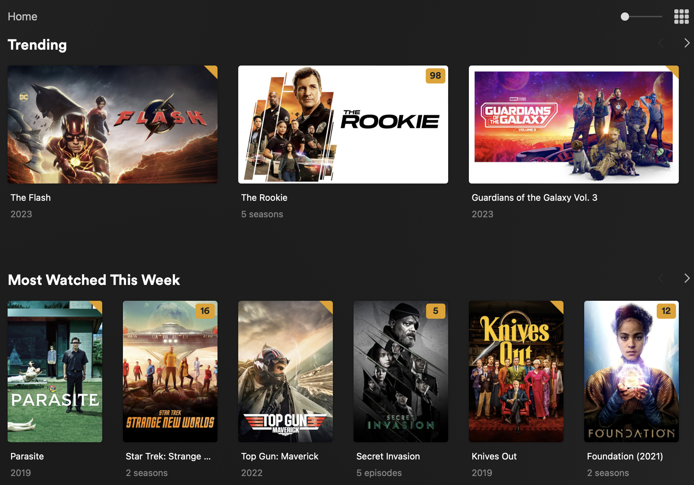

# Replex

Remix your plex recommendations.



## Features

- Merge recommendations on home into one from different libraries. Aka have movies and shows in a single row.
- Remove watched items from recommendations.
- Choose between styles, shelf (default) or hero.
- Auto load artwork for hero styles.
- Disable user state: remove unplayed badges from row items.
- Disable leaf count: remove episode count from artwork.
- Force maximum quality.
- Auto select version based on resolution of the client.
- Fallback to different version if selected version is video transcoding.
- Works on every client/app not only plex web!
- Plays nice with PMM (and without).

!!This does not alter your plex data in anyway. it only alters outgoing api requests. All your collections or rows are kept intact!!

## Installation

Run the docker image with REPLEX_HOST set to your plex instance.

```
docker run --rm -it -p 3001:80 -e REPLEX_HOST="http://0.0.0.0:32400" -e REPLEX_HERO_ROWS="movies.recent,movie.recentlyadded" ghcr.io/lostb1t/replex:latest
```

add your proxy url to plex "Custom server access URLs" (ex http://0.0.0.0:3001)

then access your proxy url http://0.0.0.0:3001

Docker compose example including plex:

```yml
version: "3"
services:
  plex:
    image: lscr.io/linuxserver/plex:latest
    container_name: plex
    environment:
      - PUID=1000
      - PGID=1000
      - TZ=Etc/UTC
      - VERSION=docker
      # claim from https://plex.tv/claim 
      - PLEX_CLAIM=
    ports:
      - 32400:32400
     volumes:
       - /path/to/library:/config
       - /path/to/tvseries:/tv
       - /path/to/movies:/movies
    restart: unless-stopped
  replex:
    image: ghcr.io/lostb1t/replex:latest
    container_name: replex
    environment:
      REPLEX_HOST: http://plex:32400
    ports:
      - 3001:80
    restart: unless-stopped
    depends_on:
      - plex
```

## Settings

Settings are set via [environment variables](https://kinsta.com/knowledgebase/what-is-an-environment-variable/) 

| Setting        	          | Default 	| Description                                                            	  |
|---------------------------|----------|---------------------------------------------------------------------------|
| REPLEX_HOST               |        	 | Url of your plex instance. ex: http://0.0.0.0:32400                                             	  |
| REPLEX_INTERLEAVE         | true      | Interleave home
recommendations. Rows from sifferent sections are interlewved into one.                                           	  |
| REPLEX_HERO_ROWS          |        	 | Comma seperated list of hubidentifiers to make hero style, options are: <br />home.movies.recent<br />movies.recent <br />movie.recentlyadded<br />movie.topunwatched<br />movie.recentlyviewed<br />hub.movie.recentlyreleased<br />movie.recentlyreleased<br />home.television.recent<br />tv.recentlyadded<br />tv.toprated<br />tv.inprogress<br />tv.recentlyaired    |
| REPLEX_EXCLUDE_WATCHED    | false    | If set to true, hide watched items for recommended rows                                     |
| REPLEX_DISABLE_CONTINUE_WATCHING | false    | Disable/remove the continue watching row |
| REPLEX_DISABLE_USER_STATE | false    | Remove unplayed badges from row items |
| REPLEX_DISABLE_LEAF_COUNT| false    | Remove episode count label from show artwork.                              |
| REPLEX_FORCE_MAXIMUM_QUALITY    | false    | This will force clients to use the maximum quality. Meaning that if a client requests anything other then the maximum quality this will be ignored and the maximum quality (direct play/stream when server allows for original) is used instead. This doesn't prevent transcoding. It only sets the bitrate to original quality. So if a client needs a different codec, container or audio it should still transcode. 
| REPLEX_FORCE_DIRECT_PLAY_FOR    | false    | Force direct play for the given resolutions. Options are "4k", "1080" and "720".  This wil result in an error message if the client does not support directplay. Not recommended      
| REPLEX_VIDEO_TRANSCODE_FALLBACK_FOR    |     | If the selected media triggers a video transcode. Fallback to another version of the media. Only triggers on video transcoding. Remuxing is still allowed. <br />Options are "4k" and "1080". <br /> <br /> Example if  REPLEX_VIDEO_TRANSCODE_FALLBACK_FOR is set to "4k" then 4k transcodes will fallback to another version if avaiable |
| REPLEX_AUTO_SELECT_VERSION    | false    | If you have multiple versions of a media item then this setting will choose the one thats closest to the client resolution. So a 1080p TV will get the 1080P version while 4k gets the 4k version. A user can still override this by selecting a different version from the client.   |
| REPLEX_DISABLE_RELATED  | false | See: https://github.com/lostb1t/replex/issues/26.        |
| REPLEX_REDIRECT_STREAMS  | false    | Redirect streams to another endpoint.                                      |
| REPLEX_REDIRECT_STREAMS_HOST  | REPLEX_HOST    | Alternative streams endpoint                                         |
| REPLEX_CACHE_TTL          | 1800    	 | Time to live for caches in seconds. Set to 0 to disable (not recommended).  |

## Mixed rows

Custom collections with the same name from different libraries will be merged into one on the home screen,
So an collection named "Trending" in the Movie library will be merged with an collection named "Trending" from a shows library on home.

Note, this does not work on builtin recommendations. As i personally dont see then need of mixing those. 
You can recreate the builtin rows with smart collections if you wish to have that functionality, or with PMM ofcourse.

## Row style

For custom collections you can change the hub style to hero elements by setting the label "REPLEXHERO" on an collection.

For built in rows you can use the hubidentifier in the `REPLEX_HERO_ROWS`. See the setting for available know options.

Note: hero style elements uses coverart from plex. Banner or background is not used.
Note: Hero elements are not supported for continue watching by plex. You can replicate this functionality by creating a smart collection which filters on in progress and settinf REPLEX_DISABLE_CONTINUE_WATCHING

## Exclude watched items

If you want to hide watched items from your rows, you can set `REPLEX_EXCLUDE_WATCHED` to true. Alternatively, you can add the label "REPLEX_EXCLUDE_WATCHED" to a collection to exclude watched items from that collection only.


## Remote access (force clients to use the proxy)

Because this app sits before Plex the builtin remote access (and auto SSL) will not work and needs to be disabled.

For testing purposes you can access through the browser at http://[replexip]:[replexport] (ex: http://localhost:3001)
But if you want other clients to connect to replex you need to setup a reverse proxy with a domain and preferable ssl.

A few easy to setup reverse proxys are: https://caddyserver.com or https://nginxproxymanager.com

Once you have your domain hooked up to replex add your replex url to 'Custom server access URLs' field under network.
and lastly disable remote access under remote access. 

Clear you clients caches to force plex reloading the custom server url

Note: SSL is highly suggested, some clients default to not allowing insecure connections. And some clients dont even support insecure connections (app.plex.tv)


## Reverse proxy

There should be no need for this but if you have a reverse proxy running and dont want to proxy streaming through plex then you can route the following paths and it subpaths directly to plex.

- /video/:/transcode/universal/session
- /library/parts

## Redirect streams

If you have for example an appbox it might not be ideal to stream media through replex. As that will take a lot of network resources.
You can redirect streams by enabling `REPLEX_REDIRECT_STREAMS` and optionally set `REPLEX_REDIRECT_STREAMS_HOST` if it needs to be different from REPLEX_HOST

Note: Plex doesnt handle redirects wel, and will not remeber it. So every chuck of a stream will first hit replex and then gets redirected to actuall download that chuck from the redirect url. So a bit wastefull

## Known limitations

- hero rows on Android devices dont load more content. so hero rows have a maximum of 100 items on Android.
- On android mobile hero elements in libraries are slightly cutoff. This is plex limitation.
- when exclude_watched is true a maximum item limit per library is opposed of 250 items. So if you have a mixed row of 2 libraries the max results of that row will be 500 items.
- disable_user_state: For movies this works in the webapp. Shows work accross clients

## Help it doesnt work!

### Replex works on on app.plex.tv but not on my clients

- disable GDM in plex and make sure plex is not directly acccesible. you can use this url to check what servers plex communicates to your clients: https://clients.plex.tv/api/v2/resources?includeIPv6=1&includeRelay=1&X-Plex-Language=en-NL&X-Plex-Token=YOURTOKEN&X-Plex-Client-Identifier=1234
- Try to clear the cache on the client. Old plex domains might linger.
